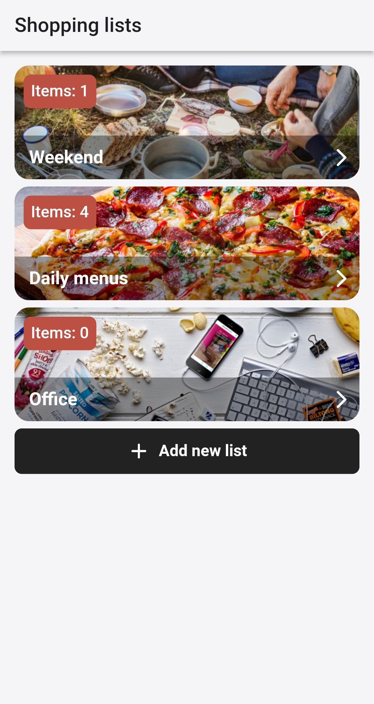
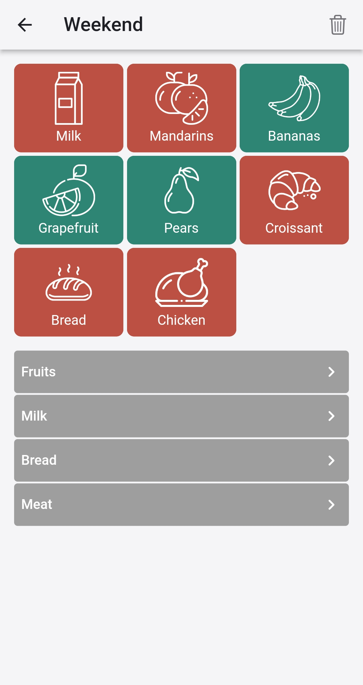
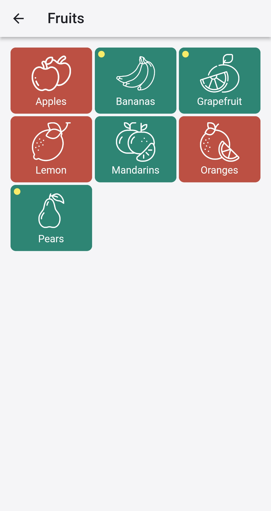
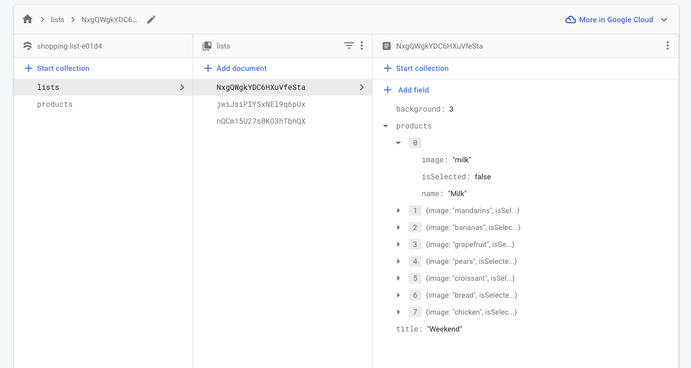
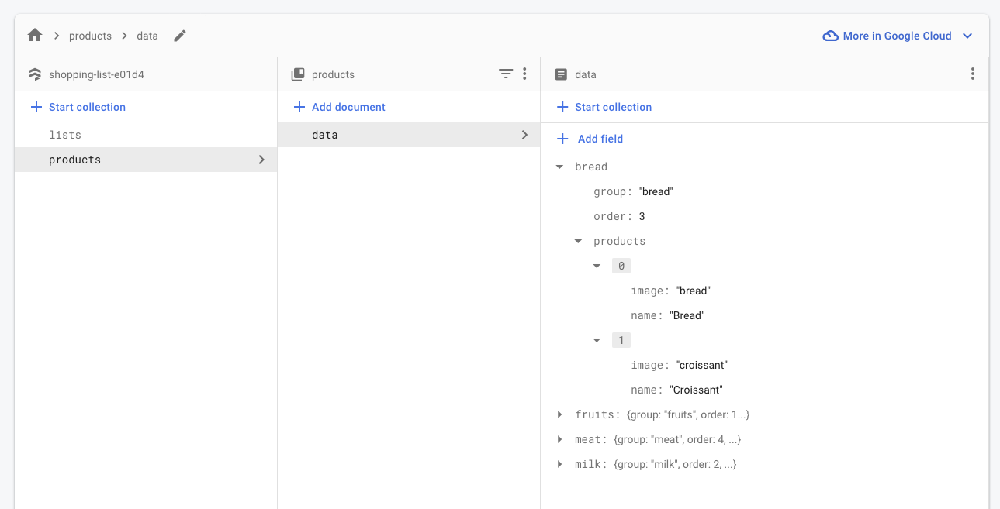

# Shopping list test task


Simple shopping list application. 

`Bring!` application was taken as an example:
- [Android](https://play.google.com/store/apps/details?id=ch.publisheria.bring)
- [iOS](https://apps.apple.com/de/app/bring-shopping-list-recipes/id580669177?l=en)

## Goal
The goal of the application is to make everyday shopping easier by enabling the user to list down items to buy. While shopping, the application should also help track items that are already collected and make sure the user does not forget anything.

## About the app
Since the application uses Firebase snapshot listeners it is possible to use the application simultaneously on several devices and if one of the users adds, updates or deletes something then the second user will immediately see all the changes submitted by the first user.

Pages:
- main page with shopping lists<br>
<br><br>
- create new shopping list<br>
<br><br>
- shopping list (already selected products and product category list)<br>
<br><br>
- products by category (add to shopping list)<br>


** if some product has been added to the cart and marked as purchased, then in the list of products by category in the upper left corner an inductor will be displayed that this product has already been purchased(yellow dot). It means that this product cannot be removed from the basket. First it should be marked as unpurchased in the basket.


# Architecture

[BLOC pattern](https://medium.com/flutterpub/architecting-your-flutter-project-bd04e144a8f1)

# Cloud Firestore
- Shopping lists<br>

<br><br>
- All products<br>



# CI tool 
- [code](https://github.com/ViktorKirjanov/flutter_shopping_list_test/blob/main/.github/workflows/ci.yml)
- [workflows](https://github.com/ViktorKirjanov/flutter_shopping_list_test/actions)

# Compile and run the application
The command compiles to debug mode:
```
flutter run
```

The command compiles to release mode:
```
flutter run --release
```


The command compiles to profile mode:
```
flutter run --profile
```


More information:
- [debug mode](https://docs.flutter.dev/testing/build-modes#debug)
- [release mode](https://docs.flutter.dev/testing/build-modes#release)
- [profile mode](https://docs.flutter.dev/testing/build-modes#profile)


# Run tests in a terminal 

You can also use a terminal to run the tests by executing the following command from the root of the project:
 
```
flutter test test
```
List of test:
- BLOC test
  - Events
  - BLOCs
  - States
- model test
- widget test


More information about testing: [documentation](https://docs.flutter.dev/cookbook/testing/unit/introduction#run-tests-in-a-terminal)


# TODO:
Problem: Firebase has `arrayUnion()` and `arrayRemove()` to add and remove elements. But nothing shows how to update the already created element within the list. There is an alternative, which is to read the entire document on the client, modify the items in the array and then write the whole list back to Firestore.

The goal: find another way to update only one element in an array or store in a map instead of an array.
